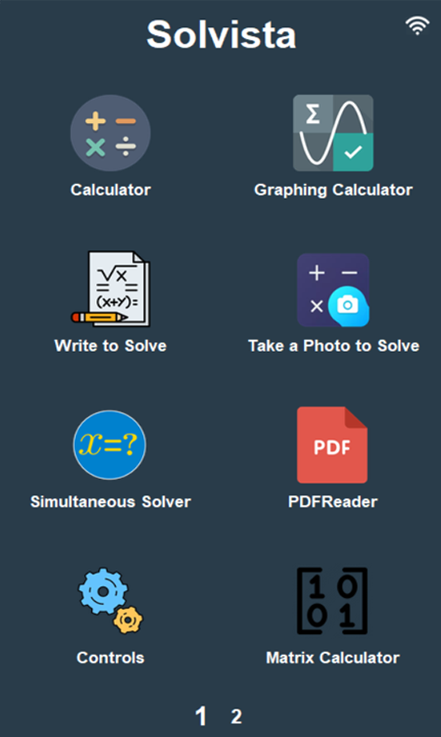
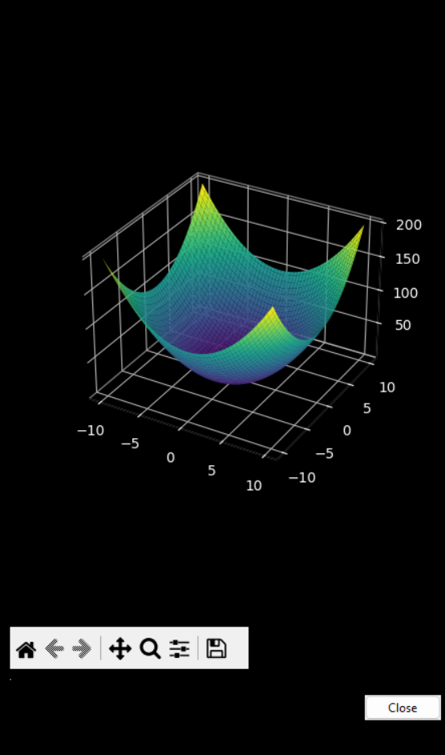
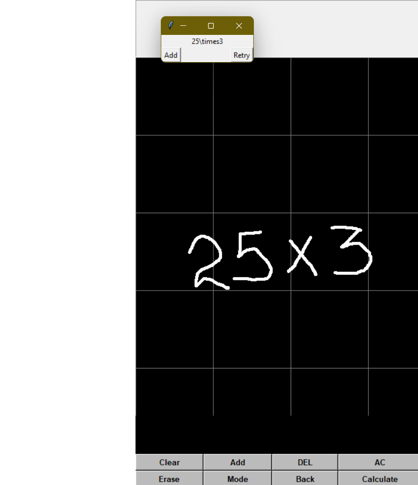
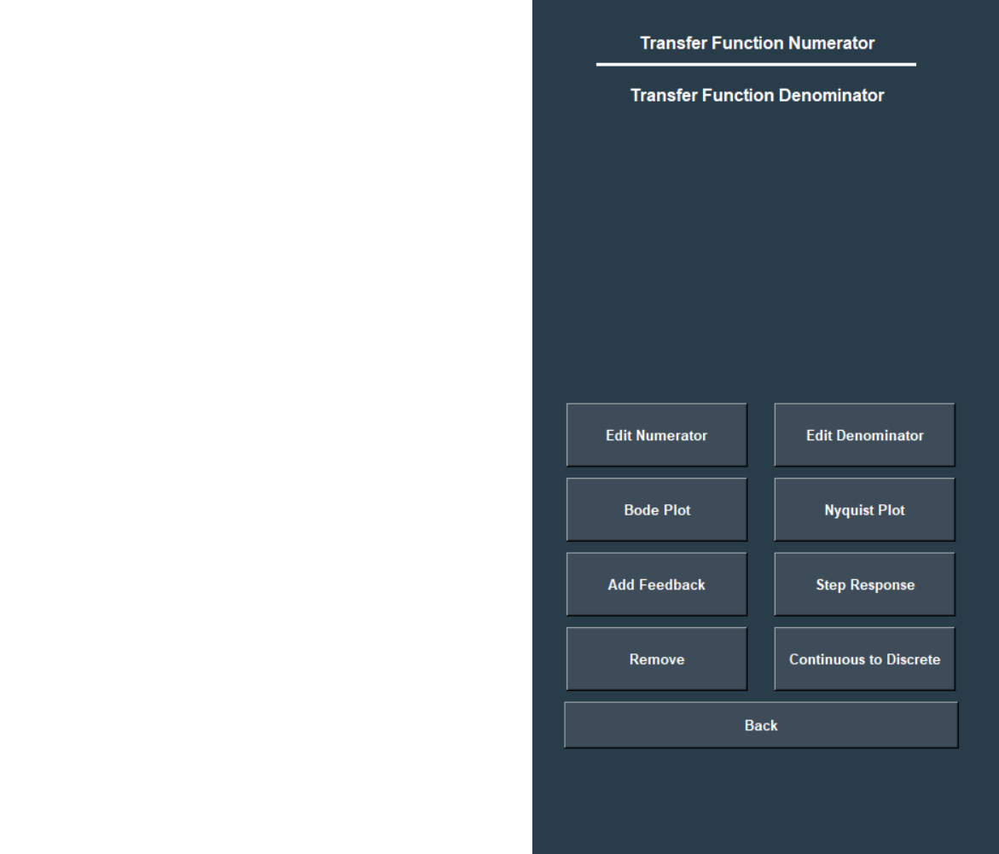

  

# Solvista

The SOLVISTA Smart Calculator is an advanced multi-functional device designed to integrate various mathematical tools into a single touch-screen interface. It enhances productivity and efficiency by combining traditional calculator functions with innovative features such as photo-based problem-solving and dynamic graph plotting.

## Authors

- [@Buddhi Wijenayake](https://www.github.com/Buddhi19)
- [@Manuli Karunarathne](https://www.github.com/ManuliYK)
- [@Athulya Ratnayake](https://www.github.com/athulya24453)
- [@Thimira Hirushan](https://www.github.com/ThimiH)

## User Manual

[Find the user manual here](docs/calculator_user manual.pdf)

## Features

- **5-inch Touch Screen Display:** A responsive touch interface for easy navigation and input.

- **Multiple Calculators:** Includes a scientific calculator, graphing calculator, matrix calculator, Laplace transform calculator, Fourier transform calculator, Z transform calculator, and normal distribution calculator.

- **Handwriting and Photo-Based Solving:** Allows users to write mathematical expressions directly on the screen or take photos of handwritten problems to solve them instantly.

- **Integrated Camera:** Facilitates the photo-based solving feature, enabling users to capture and process mathematical expressions.

- **Rechargeable Battery:** Ensures portability and convenience.

- **PDF Reader:** Provides the ability to read PDF documents, useful for referencing and studying.
## Demo

  
  
  
  

